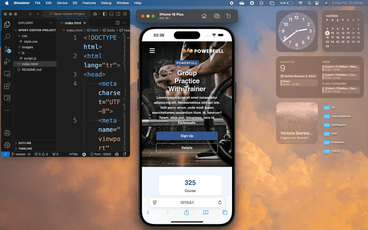

# Sport Center Web App

A modern, fully responsive fitness center website built with HTML, CSS, and JavaScript.  
The project simulates a real-world single-page application for a sport center, including scroll-linked navigation, dynamic content filtering, live BMI calculation, interactive UI components, and mobile-first design targeting 576px breakpoint.

Developed as part of the Patika+ graduation project requirements, with an emphasis on clean UI, functional UX, and maintainable code structure.

## 🔗 Live Demo

You can view the deployed version here:  
[Live Site on Netlify](https://sport-center-patika.netlify.app)

## 🎥 Project Previews

### 💻 Desktop View  


### 📱 Mobile View  


---

##  Features

- **Responsive Design**  
  Fully optimized for small screens down to **576px**.

- **Sticky Navigation Bar**  
  Navbar remains fixed and changes background color to `#355592` upon scrolling.

- **Smooth Anchor Navigation**  
  Section links scroll smoothly to their targets.

- **BMI Calculator**  
  Calculates BMI based on user input, displays result and highlights category with a moving arrow.

- **Our Classes Filtering**  
  Filter buttons dynamically display matching class content using JavaScript.

- **Our Best Trainers Hover Effect**  
  Hover reveals trainer details. All 3 cards are interactive.

- **Interactive Google Map**  
  Embedded Google Map in Contact section – fully interactive, not a static image.

- **Auto-Updating Footer Year**  
  Footer year updates automatically with JavaScript.

- **Clean Codebase**  
  Semantic HTML5, descriptive variable names, comments for clarity, and structured CSS.

---

## 🛠️ Technologies Used

- **HTML5** – Semantic markup and structure  
- **CSS3** – Styling and responsive layout  
- **JavaScript (Vanilla)** – DOM manipulation and interactivity  
- **Google Fonts** – Custom web fonts (Poppins)  
- **Font Awesome 6** – Icons for buttons and interface elements  
- **Google Maps API** – Embedded interactive map  
- **Netlify** – Hosting and deployment

---

### Run Locally

```bash
git clone https://github.com/halenurincedere/sport-center-project.git
cd sport-center-project.
````

Then open index.html in your browser.


## Folder Structure

```bash
sport-center-project/
├── index.html
├── /css/
│   └── style.css
├── /js/
│   └── script.js
├── /images/
│   ├── bmi-index.jpg
│   ├── client1.jpg
│   ├── client2.jpg
│   ├── desktop-view.png
│   ├── group.webp
│   ├── logo.pgn
│   ├── mobil-view.jpg
│   ├── yoga.jpg
│   ├── solo.jpg
│   ├── stret.webp
│   ├── trainer1.jpg
│   ├── trainer2.jpg
│   ├── trainer3.jpg
│   ├── purchase1.jpg
│   ├── purchase2.jpg
│   ├── purchase3.jpg
│   └── purchase4.jpg
└── README.md

````

## License

This project is licensed under the MIT License.
